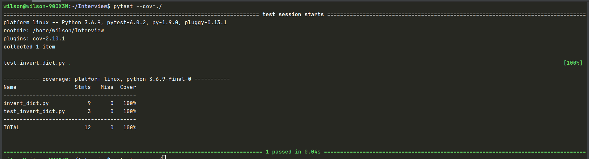

# Interview
This repo is a place I share my answers to coding interview questions.

## Unit Test
### Install
`$ pip3 install pytest`  
`$ pip3 install pytest-cov` 

### Run Unit Test
In this directory  
`$ pytest`

### Test Coverage
`$ pytest --cov=./`

The result will print out in console and the test coverage is 100%.

